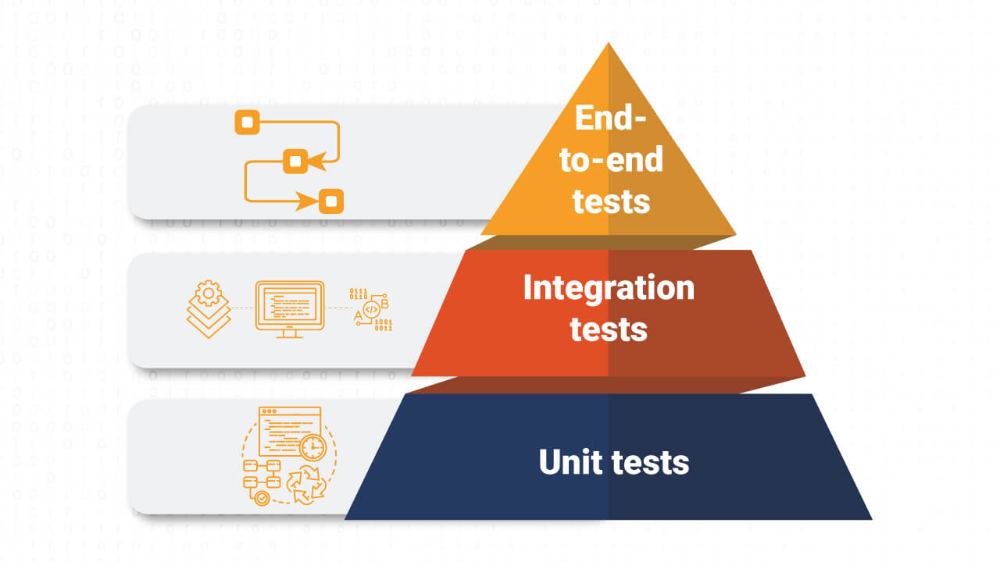

# Teststrategi

## Teststrategi i vores projekt
For at sikre applikationens stabilitet og funktionalitet, er der arbejdet med en teststrategi baseret på testpyramiden. Denne strategi tager udgangspunkt i, at størstedelen af testene er unit tests, mens færre og mere omfattende tests er end-to-end tests.
Teststrategien har fokus på både isoleret validering af forretningslogik og test af brugerflows i applikationen. Dette hjælper til at finde fejl tidligt i udviklingsprocessen og bidrager til refaktorering. 



--- 
## Unit tests
For at teste edge cases er der anvendt Vitest, med henblik på at teste isolerede funktioner uafhængigt af brugergrænsefladen.

--- 

## Create House – form validation

Der er udført tests på form validering ved oprettelse af huse.
I denne test valideres det om inputtet er udfyldt med valid data, og fejler hvis dataen ikke er udfyldt korrekt. 


### Eksempel fra `validateHouseForm.test`

```js
it('returns null when all fields are valid', () => {
  expect(validateHouseForm(validForm)).toBeNull()
})
 
 it('returns null when all fields are valid', () => {
        expect(validateHouseForm(validForm)).toBeNull()
    })
    
    it('rejects when address is empty', () => {
        expect(validateHouseForm({ ...validForm, address: '' })).toBe('Udfyld alle felter')
    })
    
    it('rejects an address with only numbers', () => {
        expect(validateHouseForm({ ...validForm, address: '12345' })).toBe('Adressen må ikke kun indeholde tal')
    })
    
    it('rejects a postal code with letters', () => {
        expect(validateHouseForm({ ...validForm, postalCode: '22AB' })).toBe('Postnummer må kun indeholde tal')
    })
    
    it('rejects when city is missing', () => {
        expect(validateHouseForm({ ...validForm, city: '' })).toBe('Udfyld alle felter')
    })
    
    it('rejects when no image is selected', () => {
        expect(validateHouseForm({ ...validForm, image: null })).toBe('Udfyld alle felter')
    })

```

---

## To do
Der er udført tests på todo opgaverne, som kontrollere om logikken i todo funktionen opfører sig som forventet. 

### Eksempel fra `applyToggle.test`

```js
    it('returns null when all fields are valid', () => {
        expect(validateHouseForm(validForm)).toBeNull()
    })
    it('rejects when address is empty', () => {
        expect(validateHouseForm({ ...validForm, address: '' })).toBe('Udfyld alle felter')
    })
    it('rejects an address with only numbers', () => {
        expect(validateHouseForm({ ...validForm, address: '12345' })).toBe('Adressen må ikke kun indeholde tal')
    })
    it('rejects a postal code with letters', () => {
        expect(validateHouseForm({ ...validForm, postalCode: '22AB' })).toBe('Postnummer må kun indeholde tal')
    })
    it('rejects when city is missing', () => {
        expect(validateHouseForm({ ...validForm, city: '' })).toBe('Udfyld alle felter')
    })
    it('rejects when no image is selected', () => {
        expect(validateHouseForm({ ...validForm, image: null })).toBe('Udfyld alle felter')
    })
```
